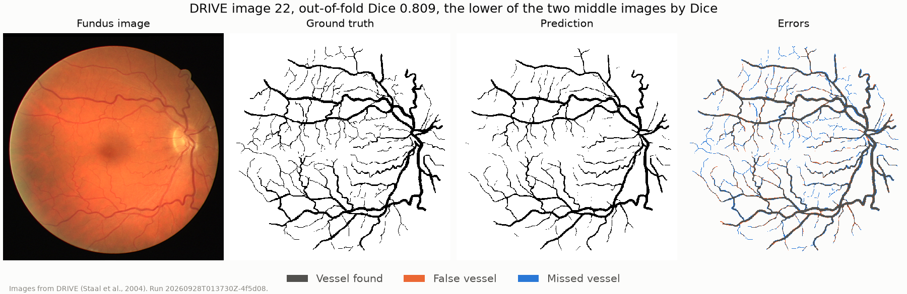
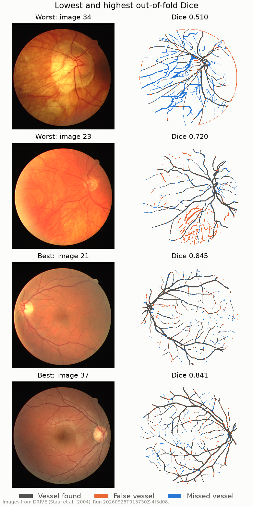
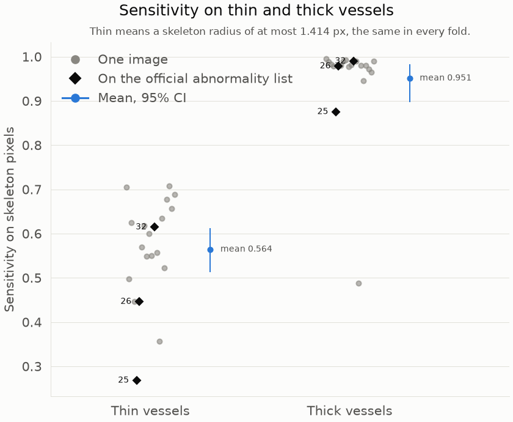
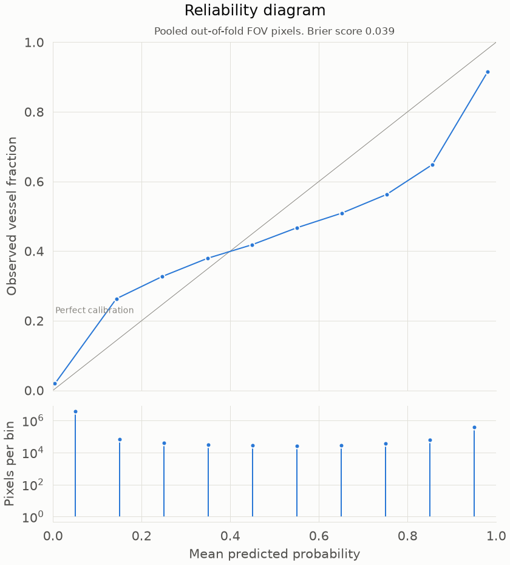
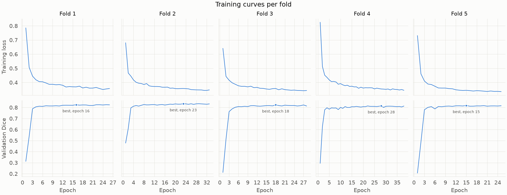

# Retinal vessel segmentation on DRIVE

[](https://github.com/nickmelamed/retinal-vessel-segmentation/actions/workflows/ci.yml)


A small neural network (a U-Net) that marks the blood vessels in color
photographs of the back of the eye, trained and tested on the public DRIVE
dataset. It is a learning project on public data and is not for clinical use.
Every image is scored by a model that did not train on it. The model
finds the wide vessels well and misses many of the finest ones.



*Image 22 is shown because it sits at the median Dice. With 20 images the
median falls between two images, and image 22 is the lower of the two. In the
error map, gray is a vessel found, orange a false vessel, and blue a missed
vessel.*

- Dice overlap with the hand-drawn vessels: 0.794 (95% CI 0.759 to 0.818),
  the mean over 20 out-of-fold images.
- Area under the precision-recall curve: 0.886 (95% CI 0.849 to 0.909).
- Sensitivity on thin vessels is 0.564 (95% CI 0.513 to 0.612), against 0.951
  (0.897 to 0.984) on thick ones.

A results site with the statistical report is in progress (see
[In progress](#in-progress)).

## Results

DRIVE publishes vessel labels for its 20 training images only, so all results
come from 5-fold cross-validation over those 20 images, split by whole image.
Each fold holds out 4 images for testing, uses 2 for early stopping and for
choosing the probability threshold, and trains on the other 14. Every image is
a test image exactly once, so each of the 20 has one out-of-fold prediction,
and all metrics are computed inside the circular field of view (FOV) mask. The
numbers come from run `20260928T013730Z-4f5d08`, trained from the tag
`v0.1.0-rc.1` on a Colab Tesla T4 (see [Reproduce](#reproduce)).

| Metric | Mean | 95% CI of mean | Median | Min | Max |
|---|---|---|---|---|---|
| Dice | 0.794 | 0.759 to 0.818 | 0.812 | 0.510 | 0.845 |
| Sensitivity | 0.783 | 0.731 to 0.821 | 0.810 | 0.392 | 0.873 |
| Specificity | 0.975 | 0.971 to 0.979 | 0.977 | 0.954 | 0.991 |
| Precision | 0.817 | 0.787 to 0.845 | 0.835 | 0.649 | 0.920 |
| AUC-ROC | 0.970 | 0.952 to 0.980 | 0.979 | 0.812 | 0.987 |
| AUC-PR | 0.886 | 0.849 to 0.909 | 0.904 | 0.585 | 0.929 |
| Accuracy | 0.950 | 0.943 to 0.956 | 0.953 | 0.893 | 0.966 |
| Brier score | 0.039 | 0.034 to 0.046 | 0.037 | 0.027 | 0.097 |

Intervals are percentile bootstraps of the mean over the 20 images. The full
tables, with SD and every image, are in [results/tables](results/tables).

Accuracy looks high because most of the FOV is background. Vessels cover
0.125 of all FOV pixels, and predicting no vessel anywhere would already score
a mean accuracy of 0.875 over these images. For the same reason AUC-ROC is
flattered by the many easy background pixels, and AUC-PR, which ignores true
negatives, is the more informative of the two.

Published DRIVE results are usually reported on the official 20-image test
split, scored on the challenge site. These numbers come from cross-validation
on the training images and are not directly comparable to them.

### Where it fails



*The two lowest and two highest out-of-fold Dice images (34, 23, 21, 37),
chosen by rank. None of them is on DRIVE's list of images with
abnormalities.*

Image 34 is the clear failure, with a Dice of 0.510, where every other image
scores at least 0.720. A large bright area surrounds its optic disc, and the
model misses many wide vessels that cross it. It also marks a thin false arc
along the edge of the FOV. This project does not guess at a cause. Image 23, the next
lowest, has most of its errors in the lower half, where the background has a
visible texture that the model marks as vessel.

### Thin and thick vessels



*Sensitivity on skeleton pixels of the hand-drawn vessels, per image. Thin
means a vessel radius of at most 1.414 px at the centerline. Diamonds mark
images 25, 26, and 32, which are on DRIVE's list of images with
abnormalities.*

The vessel labels are reduced to their centerlines, each centerline pixel gets
the radius of the vessel around it, and each fold splits the pixels into thin
and thick at the median radius of its own training and validation labels. All
five folds set the same edge, 1.414 px, so thin means the same vessels in
every fold. Mean sensitivity is 0.564 (95% CI 0.513 to 0.612) on thin vessels
and 0.951 (0.897 to 0.984) on thick ones. Two images fall well below the rest
on thick vessels, image 34 at 0.488 and image 25, one of the images with
abnormalities, at 0.875.

### Calibration



*Every out-of-fold FOV pixel, grouped into ten probability bins. The lower
panel shows how many pixels fall in each bin, on a log scale.*

The pooled Brier score is 0.039. The probabilities are more extreme than the
frequencies they should match. Pixels given about 0.143 are vessel 0.263 of
the time, and pixels in the top bin, given 0.981 on average, are vessel 0.915
of the time. The segmentation itself uses a thresholded mask, so this matters
most for any later use of the probabilities, such as the planned uncertainty
maps.

### Images with abnormalities

DRIVE's site lists abnormalities for three of the training images. Their notes
are quoted word for word in [results/tables/pathology.md](results/tables/pathology.md).

| Image | Dice | Sensitivity | AUC-PR |
|---|---|---|---|
| 25 | 0.752 | 0.637 | 0.885 |
| 26 | 0.795 | 0.754 | 0.886 |
| 32 | 0.817 | 0.855 | 0.908 |

The median Dice of the other 17 images is 0.814. Image 25 has the lowest
thin-vessel sensitivity of all 20 images, 0.268. With three images this is a
description only, and supports no statistical test. The abnormal images were
placed in three different test folds so that none of them shares a threshold
with another.

### Training



*Training loss and validation Dice for each fold. The dot marks the epoch
whose checkpoint and threshold were kept.*

Validation Dice levels off early in every fold, and early stopping ended each
fold ten epochs after its best one. The chosen thresholds
vary more than the validation Dice does, from 0.320 in fold 2 to 0.670 in fold
4 ([per-fold table](results/tables/per_fold.md)).

## Clinical data considerations

Patient-level splitting matters because two images of the same person share
anatomy and camera settings, and a split that puts them on both sides leaks
information. DRIVE does not publish patient identifiers; we treat each image as an independent subject, which we cannot verify. <!-- style: ok -->

Classes are imbalanced, with vessels on 0.125 of FOV pixels, which is why this
README leads with Dice and AUC-PR instead of accuracy.

Labels vary. Annotators were instructed to mark pixels they were at least 70% certain were vessel, so the edges of thin vessels are uncertain by design, and the training labels come from a single annotator. <!-- numbers: ok -->

Real clinical images would need de-identification and handling under rules
such as HIPAA. For DRIVE, no patient identifiers are published.

Errors do not cost the same. A missed vessel, or a missed narrowing in later
work, can hide something a reader needs to see, while a false vessel mostly
costs review time. This model's main weakness, thin vessels, is on the missed
side.

DRIVE comes from one screening program in the Netherlands, with one camera
model. Other cameras, populations, and disease prevalence will shift what the
model sees. The size of that drop has not been measured yet, which is what
the planned external validation on STARE and CHASE_DB1 is for.

## Model governance

The probability threshold is chosen per fold to maximize mean Dice on that
fold's two validation images, over the grid i/100 for i from 1 to 99, and is
then applied unchanged to the fold's held-out images. Early stopping uses the same
validation images. No held-out image informs any choice.

Every run writes a record to a SQLite database: its config, commit, tag,
data checksum, software versions, GPU, and whether the tree was clean. Only a
run from a clean, tagged commit that passes every check in `make mark-reported`
can be reported, and only reported runs reach the tables and figures. Each
table and figure names the run, commit, and data hash it came from.

The leakage audit (`sql/queries/04_leakage_audit.sql`) returns a row for any
image that holds two roles in one fold or is a test image in two folds. For
the reported run it returns 0 rows, as recorded in the generated
[provenance table](results/tables/provenance.md). Its tests require zero rows
for valid folds and a row for each deliberate leak, and reporting a run is
refused while it returns any.

The tests use synthetic images only. They cover the metrics on hand-worked
examples, the folds, resuming an interrupted run, and the reporting checks,
and a smoke test runs training, evaluation, and the tables end to end on CI.

Known failure modes are the thin vessels, images like 34 with large bright
areas, textured backgrounds like image 23, and probabilities that are more
extreme than they should be. A frozen final model, uncertainty maps as a
signal for human review, and a frozen-model audit are planned.

## Reproduce

The numbers in this README come from the tag `v0.1.0-rc.1`. The run trained
on a Colab Tesla T4 in 35 minutes with deterministic GPU ops on, and was
evaluated on a laptop CPU from the same tag. Release `v0.1.0` contains that
run's metrics, without images or predictions, in
`results/release/experiments_v0.1.0.db`. How much the metrics vary
between reruns with the same seed is TBD.

Requires [uv](https://docs.astral.sh/uv/), which installs Python from
`.python-version`, and the DRIVE data (see [Data](#data)).

```bash
make setup                    # install the locked environment and git hooks
make check-data               # verify the data against its checksums
make train VARIANT=baseline   # 5-fold cross-validation, resumable
make verify-checkpoints RUN=<run_id>
make evaluate RUN=<run_id>    # from a clean checkout of the run's tag
make mark-reported RUN=<run_id>
make tables figures           # regenerate results/tables and figures/
make help                     # list every target
```

GPU runs go through `notebooks/colab_runner.ipynb`. A one-command
`make reproduce` and a Docker image are planned.

## Limitations

DRIVE is small, with 20 labeled images, so the confidence intervals are wide
and one image can move a mean. The training labels come from a single
annotator. Every DRIVE image was JPEG compressed by the providers, which can
blur the finest vessels. Only three training images have abnormalities, too
few to say how the model handles disease. The model has not been tested on
any other dataset yet.

## In progress

- Ablations without CLAHE and with a Dice-only loss, and a measured rerun
  variance.
- A frozen final model, and uncertainty maps from test-time augmentation.
- Zero-shot external validation on STARE and CHASE_DB1.
- The R statistical report and the results site.
- An LSTM autoencoder that detects simulated narrowings in vessel width
  profiles.
- A diagram of how the parts fit together, `make reproduce`, and a Docker
  image.

## Data

No data is included in this repository. docs/DATA.md explains how to get DRIVE
from its official source (https://drive.grand-challenge.org/) and where to put
it. DRIVE has its own terms, separate from this code's license, and its images
are not redistributed here. The few DRIVE images in the figures are shown with
attribution.

Staal J, Abràmoff MD, Niemeijer M, Viergever MA, van Ginneken B. *Ridge-based vessel segmentation in color images of the retina.* IEEE Transactions on Medical Imaging 23(4):501–509, 2004. doi:10.1109/TMI.2004.825627. <!-- numbers: ok -->

## License

The code is under the MIT license (see LICENSE). The license does not cover
any dataset.
